
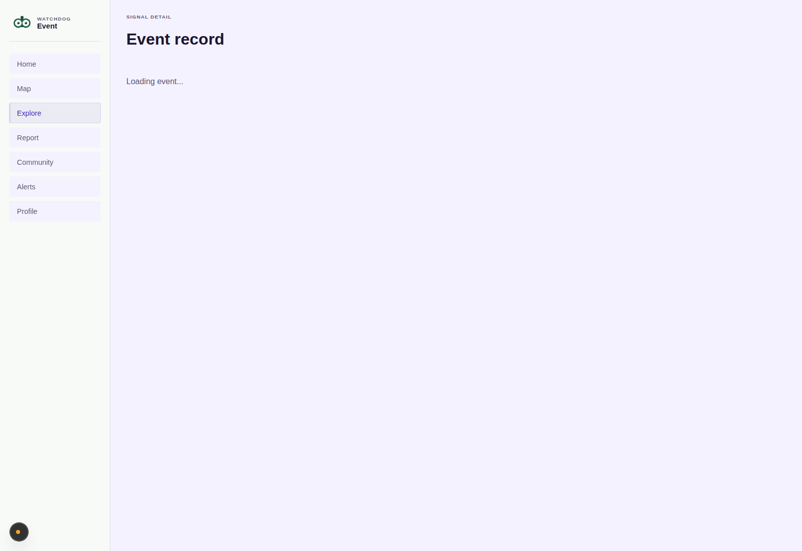
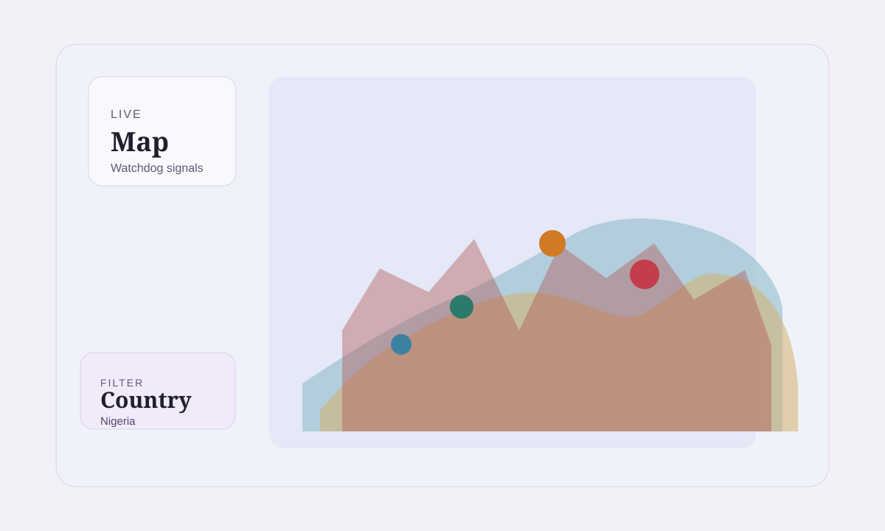

<p align="center">
  
</p>

<h1 align="center">WATCHDOG</h1>

<p align="center">
  <strong>See what is happening. Understand what is changing. Know what has been verified.</strong>
</p>

<p align="center">
  A community security and incident intelligence platform built to turn fragmented reports into structured, contextual, and reviewable intelligence.
</p>

<p align="center">
  <a href="#what-is-watchdog">What is Watchdog?</a> ·
  <a href="#how-it-works">How it works</a> ·
  <a href="#product">Product</a> ·
  <a href="#trust-model">Trust model</a> ·
  <a href="#technology">Technology</a>
</p>

<br />

<p align="center">
  
</p>

<p align="center">
  <sub>Watchdog brings incident discovery, geographic context, reporting, and intelligence into one experience.</sub>
</p>

---

## What is Watchdog?

Watchdog is a **community security and incident intelligence platform** designed for a world where important information is increasingly fragmented across social networks, messaging platforms, local communities, media, and independent reports.

When an incident occurs, people often have pieces of the story — but not the full picture.

One person reports it.

Another shares evidence.

Someone else reports something similar from nearby.

A source contradicts part of the story.

Then the question becomes:

**What should people actually understand from all of this?**

Watchdog is built around that problem.

It provides a structured environment where people can **report, discover, connect, corroborate, review, and understand incidents over time.**

---

## From scattered signals to usable intelligence

Watchdog does not attempt to reduce every incident to a single confidence number.

Instead, it preserves the journey from an initial report to a reviewed outcome.

```text
┌───────────┐
│  REPORTED │
└─────┬─────┘
      ↓
┌────────────┐
│  REVIEWING │
└─────┬──────┘
      ↓
┌───────────────┐
│ CORROBORATED  │
└──────┬────────┘
       ↓
┌────────────┐
│  VERIFIED  │
└─────┬──────┘
      ↓
┌──────────┐
│  ACTIVE  │
└────┬─────┘
     ↓
┌────────────┐
│  RESOLVED  │
└────────────┘
```

Each stage communicates something different.

A report is a **claim**.

Evidence is **supporting context**.

Corroboration provides **additional signals**.

Verification is an **explicit human decision**.

Resolution describes the **state of the incident**.

That separation is fundamental to Watchdog.

---

# Product

## Discover what is happening

Watchdog makes incident discovery geographic and contextual.

Users can explore activity around a particular area, move between local and broader views, search for relevant information, and understand incidents in relation to their surroundings.

<p align="center">
  
</p>

<p align="center">
  <sub>Geographic intelligence provides context instead of treating incidents as isolated posts.</sub>
</p>

---

## Follow the incident

The incident feed brings reports together into a structured stream that can be explored progressively.

Users can move from an initial signal into the underlying incident, its history, supporting information, and related activity.

<p align="center">
  
</p>

---

## Understand the full context

An incident should never be reduced to a headline.

Watchdog's incident experience brings together the available context around an event, including its status, location, supporting information, related signals, and review history.

<p align="center">
  
</p>

---

## Report what you know

People closest to an event can contribute structured reports with geographic context and supporting material.

The reporting workflow is designed to capture useful information while keeping the distinction between **submission** and **verification**.

<p align="center">
  
</p>

---

## Search beyond the feed

Important information should not disappear simply because it is no longer the newest post.

Watchdog provides search and discovery capabilities for navigating incidents, places, and relevant community information.

<p align="center">
  
</p>

---

# Trust model

### Evidence is not truth.

This is one of Watchdog's core principles.

A photograph can provide useful context without proving every part of a claim.

Multiple reports can strengthen an understanding of an event without making every detail certain.

A moderator can verify an incident based on available information without claiming omniscience.

Watchdog therefore avoids simplistic reputation scores and artificial "truth meters."

Instead, it keeps the underlying information visible and reviewable.

### The system distinguishes between:

| Layer             | Purpose                                              |
| ----------------- | ---------------------------------------------------- |
| **Report**        | Records what someone claims happened                 |
| **Evidence**      | Provides supporting material or context              |
| **Corroboration** | Connects related or independent signals              |
| **Conflict**      | Preserves disagreement between available information |
| **Review**        | Records an authorized human assessment               |
| **Verification**  | Represents an explicit review decision               |
| **Resolution**    | Records the eventual state of the incident           |

This makes uncertainty part of the product rather than something hidden from the user.

---

# Moderation & human review

Watchdog treats moderation as part of the intelligence system.

Authorized reviewers can evaluate incidents, inspect supporting information, handle conflicting signals, make explicit review decisions, and preserve an auditable history of those decisions.

<p align="center">
  
</p>

<p align="center">
  <sub>Human review remains explicit rather than being replaced by an opaque automated score.</sub>
</p>

---

# Community context

Security information does not exist in isolation.

People discuss incidents, follow relevant areas, receive alerts, and contribute additional context.

Watchdog keeps this community layer connected to the incident model without treating conversation itself as verification.

<p align="center">
  
</p>

---

# Personal intelligence

The platform also provides user and trust context around participation, activity, and relevant information.

<p align="center">
  
</p>

---

# Alerts that matter

Users can follow relevant areas and receive notifications as incidents and activity develop.

<p align="center">
  
</p>

---

# Architecture

Watchdog combines a modern web application, service layer, geospatial database, caching infrastructure, and automated testing into a platform designed for location-aware incident intelligence.

<p align="center">
  
</p>

---

# Technology

<p align="center">
  
  
  
  
  
  
  
  
  
  
  
</p>

| Area           | Stack                        |
| -------------- | ---------------------------- |
| Web            | Next.js · React · TypeScript |
| API            | Python · FastAPI             |
| Data           | PostgreSQL · PostGIS         |
| Infrastructure | Docker · Redis               |
| Mapping        | MapLibre                     |
| Testing        | pytest · Playwright          |

---

# Security & privacy

Watchdog is being built for a domain where information can become sensitive very quickly.

The system therefore separates public incident information from operational review context and applies authorization to sensitive workflows.

The design considers:

* geographic access boundaries
* moderation permissions
* review history
* evidence visibility
* user identity
* public redaction
* auditability
* conflicting information
* immutable review decisions

The objective is not simply to collect more information.

It is to make the **right information available to the right people at the right level of context.**

---

# What's next?

Watchdog is being developed in layers.

### Built

* Core platform
* Authentication & user system
* Incident reporting
* Incident lifecycle
* Geographic intelligence
* Maps & feeds
* Watch areas & notifications
* Evidence & source references
* Corroboration & contradiction handling
* Human verification
* Moderation & trust
* Search & discovery

### Next

**Organizations & Official Sources**

Connect organizations and trusted institutional sources to the intelligence model.

**External Intelligence**

Bring relevant external information into Watchdog while preserving the distinction between external signals and verified platform decisions.

**Regional Intelligence**

Build deeper regional understanding, patterns, and localized intelligence.

**Watchdog Intelligence**

A persistent intelligence layer over the platform's underlying data.

It will be designed to answer questions such as:

> Is this area experiencing unusual activity?

> What happened here today?

> Which reports are corroborating this incident?

> What information conflicts with the current picture?

> Give me a brief intelligence summary of this region.

This is not intended to become another generic chatbot.

**It is intended to become an intelligence interface for Watchdog's own data, context, and verification model.**

---

# Why is the source code private?

The implementation of Watchdog is currently maintained in a private repository.

That decision is deliberate.

Watchdog is an actively developed security platform, and exposing the complete implementation prematurely would reveal internal architecture, security controls, development infrastructure, unreleased functionality, and operational details that are better protected while the product is still evolving.

Keeping the source private does **not** mean the project is closed to technical scrutiny.

This public repository documents the product, its architecture, principles, technology, and direction.

For legitimate technical review, security assessment, research, collaboration, or partnership, **source-code access can be requested directly from the project author.**

Requests may be reviewed individually based on the purpose and scope of the review.

The goal is to maintain a responsible balance between:

**Transparency.
Security.
Intellectual property.
Responsible disclosure.**

---

# About this repository

This repository is the **public Watchdog showcase**.

It contains selected product visuals, product documentation, architectural context, and the public story behind the platform.

It does not contain the private application implementation.

That means you will not find:

* production source code
* private APIs
* credentials or secrets
* environment configuration
* production databases
* internal operational tooling
* unreleased implementation details

The public repository exists to let people **understand and evaluate the product without exposing the systems that operate it.**

---

# The vision

Security information is everywhere.

Context is not.

Watchdog is being built to close that gap.

Not by claiming to know everything.

Not by turning uncertainty into a score.

Not by replacing human judgment with a black box.

But by giving people better tools to **report, connect, investigate, corroborate, review, and understand what is happening around them.**

<br />

<p align="center">
  
</p>

<p align="center">
  <strong>WATCHDOG</strong><br />
  <sub>Community security · Incident intelligence · Geographic context</sub>
</p>

<p align="center">
  <sub>Built for communities. Designed to scale globally.</sub>
</p>
