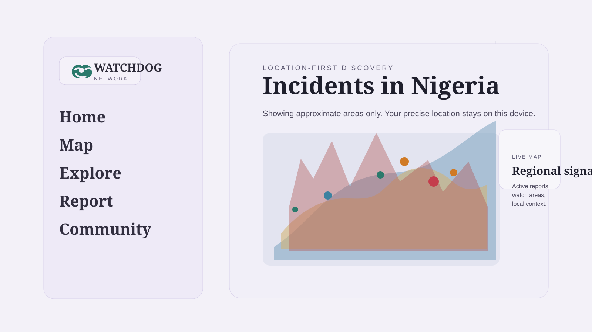

<p align="center">
  
</p>

<h1 align="center">Project Watchdog</h1>

<p align="center">
  <strong>Understand what is happening around you.</strong><br />
  A Nigeria-first community security and incident intelligence platform built around evidence, corroboration, verification, and geographic context.
</p>

<p align="center">
  
  
  
  
  
</p>

<br />

<p align="center">
  
</p>

---

## The idea

When something happens in a community, information rarely arrives in one clean, reliable package.

A message appears in a group chat.
Someone posts a location.
Another person shares a photo.
A different source reports something similar.
Then conflicting information starts spreading.

The problem is not simply **finding information**.

The problem is understanding:

**What was reported?
What supports it?
What has been corroborated?
What has actually been reviewed?
What remains uncertain?**

**Watchdog is designed around those questions.**

It gives communities a structured environment for reporting incidents, connecting supporting evidence, understanding geographic context, following developments, and seeing where human review stands.

---

## What makes Watchdog different?

Watchdog is **not a generic social network**.

It is **not a simple incident map**.

And it is deliberately **not a "truth detector."**

Instead, Watchdog treats incident intelligence as a process.

A report is a claim.

Evidence provides context.

Corroboration connects independent signals.

Human review produces explicit decisions.

Historical decisions remain traceable.

That distinction is central to the product.

### The Watchdog lifecycle

```text
REPORTED
    ↓
REVIEWING
    ↓
CORROBORATED
    ↓
VERIFIED
    ↓
ACTIVE
    ↓
RESOLVED
```

Not every report reaches the same stage.

That is intentional.

The interface should help people understand **what is known, what is supported, what has been reviewed, and what is still uncertain** rather than presenting every signal as equally reliable.

---

## Built for local situational awareness

Watchdog brings several pieces of the incident-information problem into one experience.

### Discover

Explore incidents through geographic context and location-aware feeds.

Understand what is happening around a neighborhood, city, region, or wider area without losing the relationship between an event and its location.

### Report

Create structured incident reports with relevant context and supporting material.

Reporting is designed to capture useful information without pretending that the initial submission is automatically verified.

### Understand

Move between feeds, incident details, search, and maps to build a clearer picture of an unfolding situation.

### Corroborate

Connect related signals and supporting information so that independent reports can strengthen, contradict, or contextualize one another.

### Review

Moderators and authorized reviewers can inspect reports, evidence, conflicts, and verification decisions through an explicit review process.

### Follow

Stay connected to relevant areas, events, and community activity through notifications and watch-area functionality.

---

## Trust without pretending to know everything

One of Watchdog's most important design decisions is what it **does not** try to do.

There is no arbitrary "truth score" that claims to know whether an event is real.

There is no popularity score presented as evidence.

There is no silent replacement of an old decision with a new one.

Instead, Watchdog keeps different forms of information separate:

| Signal            | What it means                                                  |
| ----------------- | -------------------------------------------------------------- |
| **Report**        | Someone has made a claim about an incident                     |
| **Evidence**      | Supporting material associated with that claim                 |
| **Corroboration** | Related or independent signals that provide additional context |
| **Review**        | An authorized human has evaluated the available information    |
| **Verification**  | A specific review decision has been made                       |
| **Conflict**      | Available information does not fully agree                     |
| **Resolution**    | The incident has reached an appropriate end state              |

This creates a system where uncertainty can remain visible instead of being hidden.

> **Evidence is not automatically truth.
> Verification is a decision, not a guess.**

---

## Geographic intelligence

Location is not decoration in Watchdog.

It is part of the information itself.

The platform uses spatial context to help users understand incidents relative to places, areas, and surrounding activity.

The goal is not simply to put dots on a map.

It is to answer questions such as:

* What is happening near me?
* What has been reported in this area?
* Are several reports related?
* How does an incident relate to surrounding events?
* What information is available for a particular region?

---

## Product experience

Watchdog brings together:

**Incident reporting**
Structured reports with location and supporting context.

**Maps & geographic exploration**
Spatial awareness across neighborhoods, cities, and regions.

**Incident feeds**
Progressive, location-aware discovery of relevant events.

**Search & discovery**
Find incidents, places, people, and relevant information.

**Evidence & corroboration**
Keep supporting material and related signals connected to the incident lifecycle.

**Human verification**
Explicit review decisions with traceable history.

**Moderation & trust**
Operational tools for handling reports, conflicts, review, and resolution.

**Community & alerts**
Follow relevant areas and stay informed as situations develop.

---

## Designed around accountability

A security platform should not only answer **"what happened?"**

It should also make it possible to understand:

* where the information came from
* what supporting material exists
* which signals agree or conflict
* who reviewed a decision
* what changed over time
* what remains unresolved

That is why Watchdog treats moderation and verification as first-class product concepts rather than hidden administrative features.

---

## Technology

Watchdog is built as a modern web platform with a strong geospatial and service-oriented foundation.

| Layer              | Technology                 |
| ------------------ | -------------------------- |
| Frontend           | Next.js, React, TypeScript |
| API                | Python, FastAPI            |
| Database           | PostgreSQL                 |
| Geospatial         | PostGIS                    |
| Caching / services | Redis                      |
| Mapping            | MapLibre                   |
| Infrastructure     | Docker                     |
| Backend testing    | pytest                     |
| Browser testing    | Playwright                 |

The architecture is designed to support location-aware discovery, structured incident workflows, evidence handling, review processes, and future intelligence capabilities.

---

## Security & privacy

Watchdog is being designed with the understanding that incident information can be sensitive.

The platform therefore treats identity, public reporting, evidence, moderation context, and verification decisions as distinct concerns.

Access to operational review capabilities is controlled by authorization and geographic scope where appropriate.

Public information is not treated as equivalent to internal moderation data.

The goal is simple:

**Expose useful context without exposing information that should remain operational or private.**

---

## Where the project is going

Watchdog is being developed progressively rather than trying to solve every intelligence problem at once.

### Completed foundations

* Core platform
* Authentication and user system
* Incident reporting
* Incident lifecycle
* Geographic and map infrastructure
* Location-aware discovery
* Evidence and source references
* Corroboration and contradiction handling
* Human verification and review
* Moderation and trust foundations
* Search and discovery

### Next

**Organizations & Official Sources**
Bring trusted organizations and authoritative sources into the information model.

**External Intelligence**
Connect relevant external information without confusing external signals with verified Watchdog decisions.

**Regional Intelligence**
Build stronger regional context and localized intelligence capabilities.

**Watchdog Intelligence**
Introduce an intelligence layer capable of answering contextual questions about areas, incidents, corroboration, conflicts, trends, and briefings using Watchdog's underlying data.

The long-term vision is not another chatbot.

It is an intelligence layer **grounded in the platform's actual incident and geographic context.**

---

## Why is the source code private?

The public repository is intentionally a **product showcase**, not the application's source repository.

Watchdog is an actively developed security-focused platform. Keeping the implementation private allows the project to protect:

* application architecture
* security-sensitive implementation details
* internal development infrastructure
* operational workflows
* unreleased functionality
* deployment configuration
* private data models and integrations

This is not intended to make the project a black box.

The product's architecture, principles, capabilities, and development direction are presented openly here.

### Source-code review

For serious technical review, research, collaboration, security assessment, or partnership discussions, **access to the private implementation can be requested**.

Requests can be considered on a case-by-case basis depending on the purpose and scope of the review.

The intention is to balance **transparency with responsible disclosure of an actively developed security platform.**

---

## This repository

This repository contains the public-facing Watchdog showcase:

* product overview
* brand assets
* selected product visuals
* architecture and design context
* technology overview
* project direction

It intentionally does **not** contain:

* the private application source
* production configuration
* environment secrets
* databases or dumps
* internal credentials
* private operational documentation
* unreleased implementation details

---

## The bigger picture

Watchdog is being built around a simple idea:

> **Better information leads to better decisions.**

But better information is not simply more information.

It is information with **context, provenance, geography, corroboration, review, and accountability.**

That is the problem Watchdog is trying to solve.

---

<p align="center">
  <strong>Project Watchdog</strong><br />
  <sub>Community security. Incident intelligence. Better context.</sub>
</p>

<p align="center">
  <sub>Built from Nigeria, with a vision for everywhere.</sub>
</p>
