

  

# Project Watchdog

  
  
  
  
  
  
  
  
  

## Global community security & incident intelligence

Watchdog is a global community security and incident intelligence platform built to help people understand what is happening around them without mistaking rumor, evidence, and verified status for the same thing.

The product is designed around signal quality: structured reporting, geographic context, corroboration, human review, and clear operational trust. It is not a generic social platform, and it does not pretend every report carries the same confidence.

> The live implementation remains private. This repository is a public product showcase only. The source code, environment files, and internal operational details are intentionally not included here.

## The problem

In fast-moving situations, people often consume safety information from fragmented sources: local conversations, social posts, scattered alerts, incomplete reports, and media updates that are hard to verify in context.

The challenge is not just collecting information. It is separating:

- a claim
- a piece of evidence
- corroborating context
- a review decision
- a verified status

Watchdog exists to make that structure visible.

## Why Watchdog matters

A report is not automatically a fact.

Evidence does not automatically equal certainty.

Corroboration adds confidence.

Verification is an explicit review outcome.

Trust is a process, not a popularity score.

The product lifecycle is intentionally modeled as:

REPORTED → REVIEWING → CORROBORATED → VERIFIED → ACTIVE → RESOLVED

## Product surfaces

### Discovery

The home experience brings local signals into place-first discovery without collapsing geography into a vague feed.

  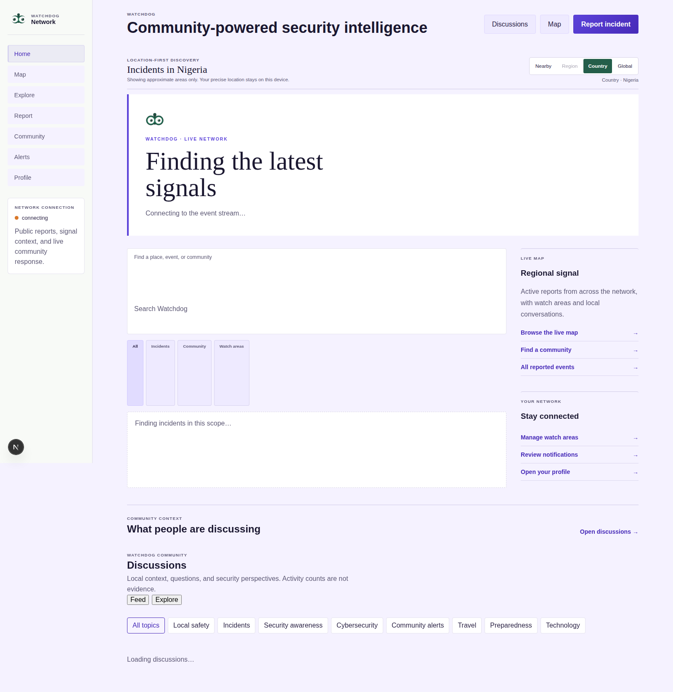

### Geographic intelligence

The map layer turns scattered reports into a navigable picture of local conditions, region-aware context, and signal density.

  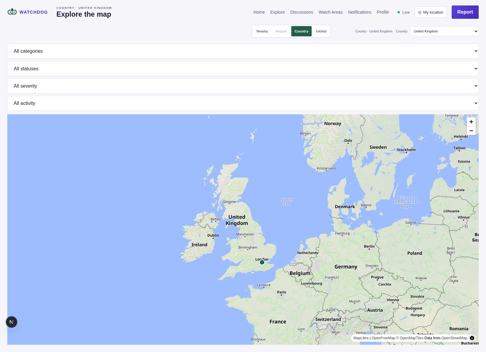

### Incident feed

The feed exposes relevant activity in a form that balances visibility with context and status.

  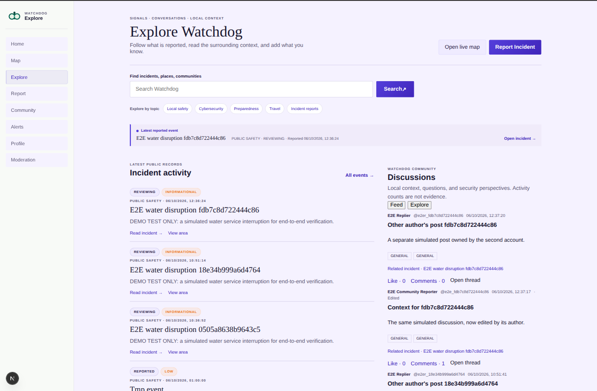

### Incident detail

Each event can carry context, review state, and evidence without flattening everything into one certainty label.

  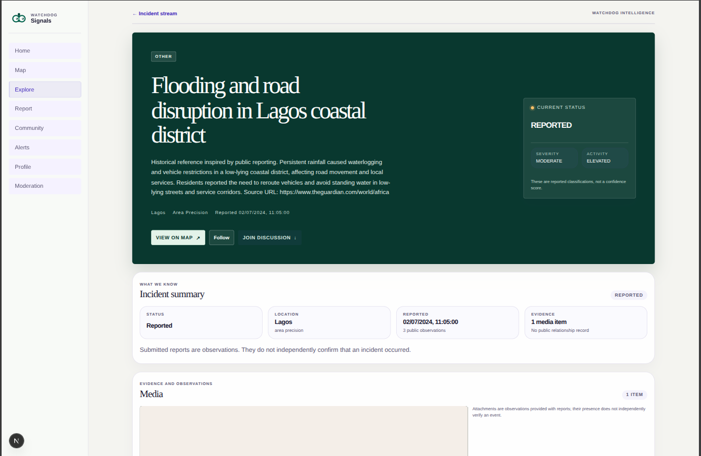

### Reporting flow

Users can create structured reports with location context and supporting media in a clear workflow.

  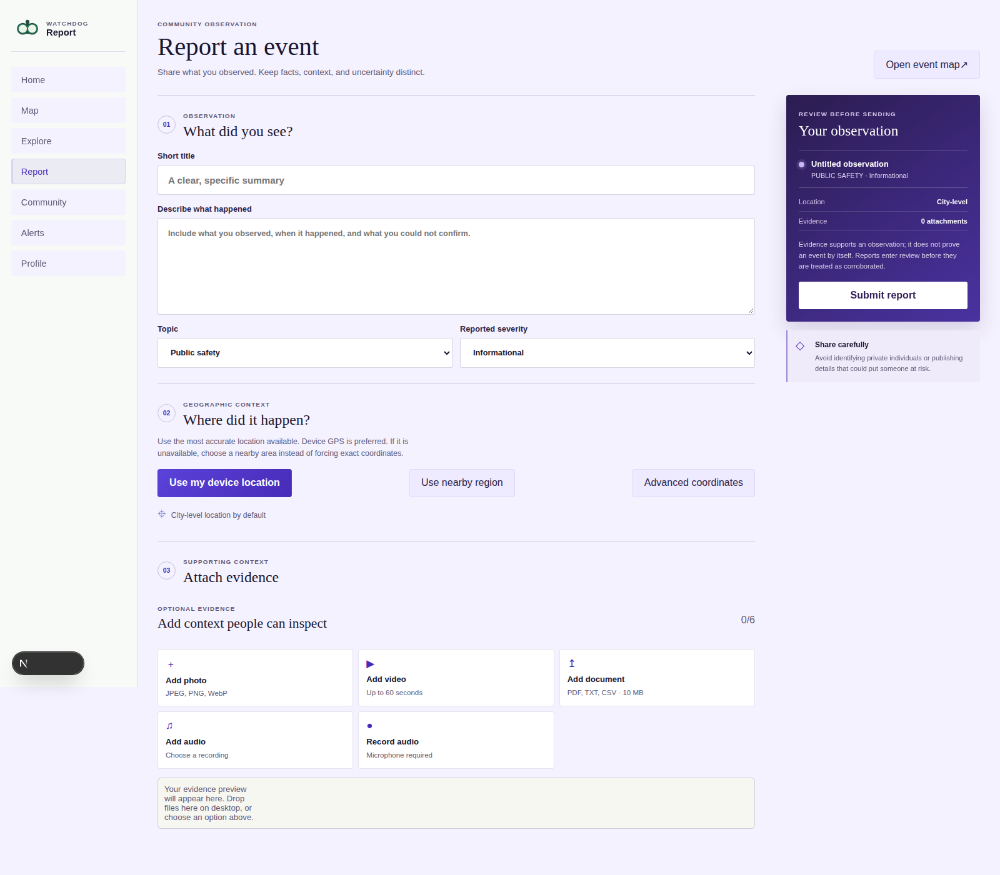

### Search and discovery

Watchdog supports search across relevant events and activity to surface the right signals in context.

  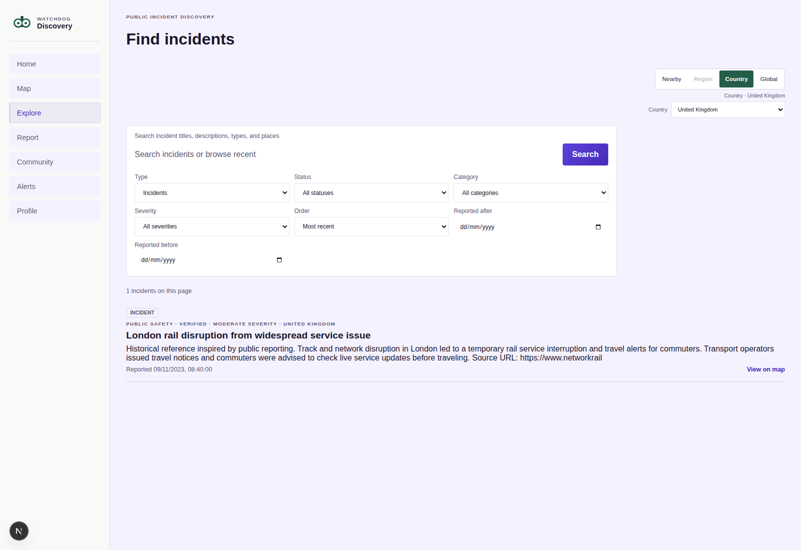

### Moderation and review

Trust is operational. Review, escalation, and contributor standing are not treated as vanity metrics.

  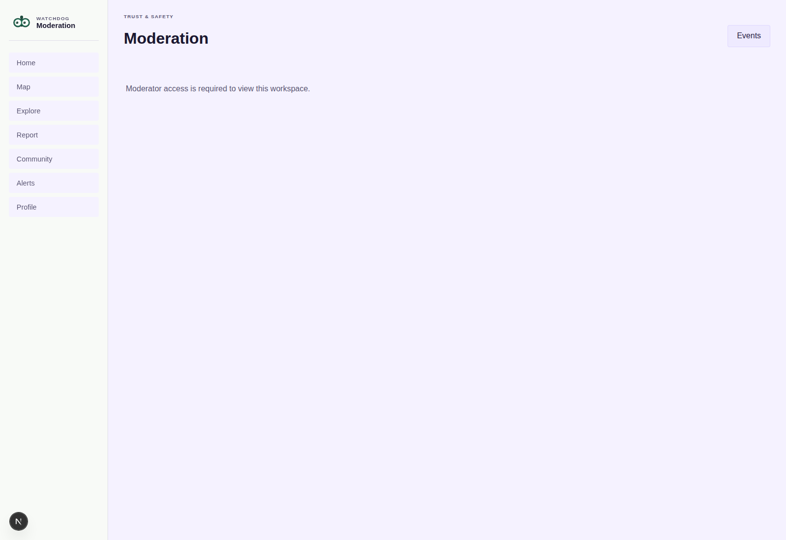

### Community and alerts

Community discussion and notifications remain distinct from verified fact and review outcomes.

  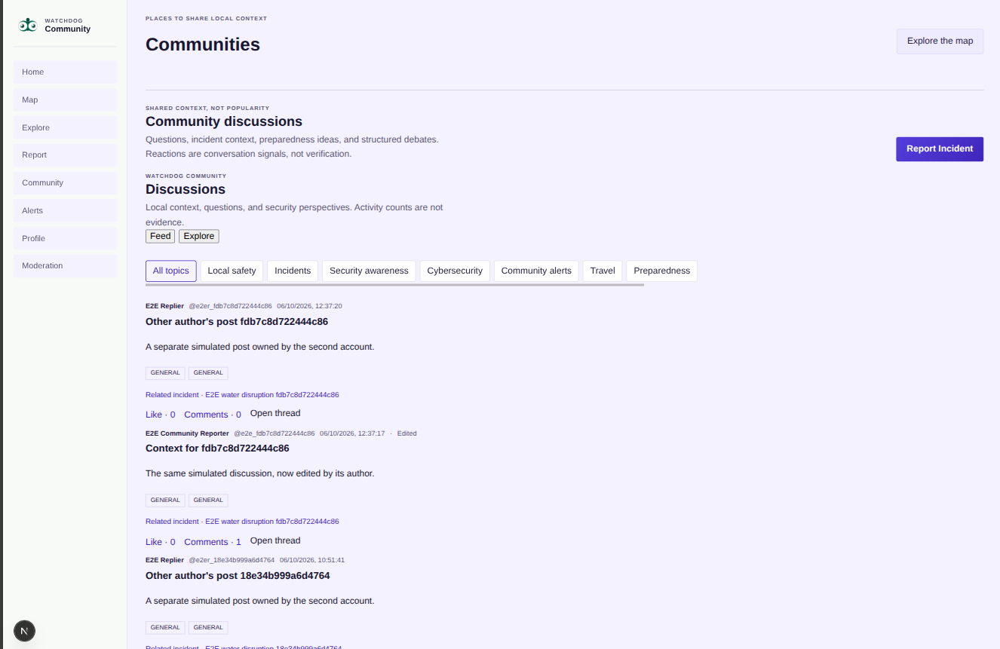
  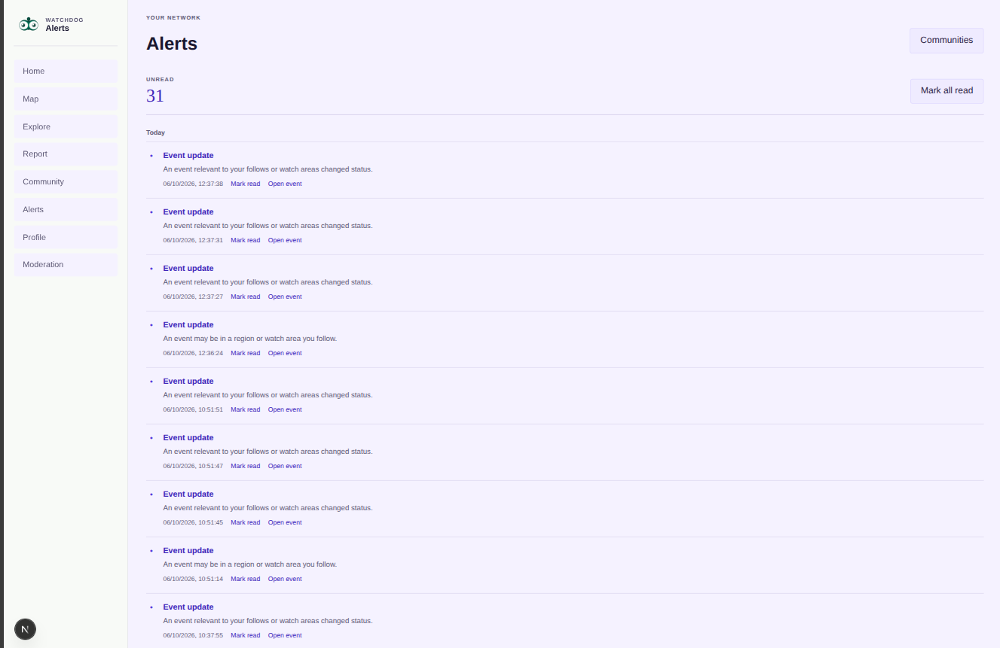

### Profile and trust context

User context and trust signals give the platform a clearer sense of contributor standing and review history.

  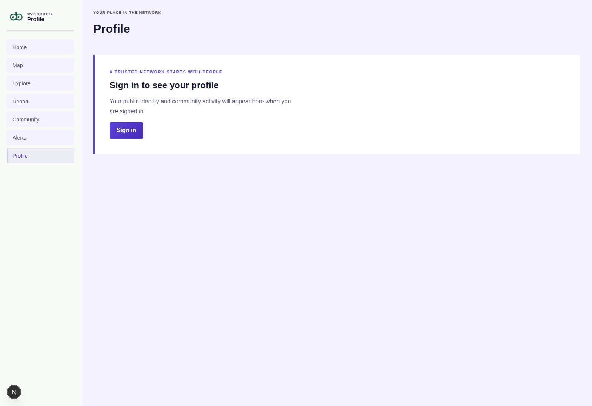

## Screenshot gallery

  
  

  
  

  
  

  
  

## Product principles

### Evidence does not equal truth

Watchdog clearly separates:

- report submission
- supporting evidence
- corroboration
- review and moderation
- verification state
- correction or revocation

This prevents the system from collapsing all incoming information into a single certainty claim.

### Geographic precision matters

The product distinguishes between device-level precision, approximate location, region scope, and broader area awareness. That matters for both trust and privacy.

### Trust is operational and visible

Contributor standing, moderation context, and explicit status changes are treated as product signals rather than simplistic popularity metrics.

## Architecture

The current platform is structured around a real multi-layer product stack: a frontend, API, relational and geospatial database, realtime services, and moderation/review workflows.

  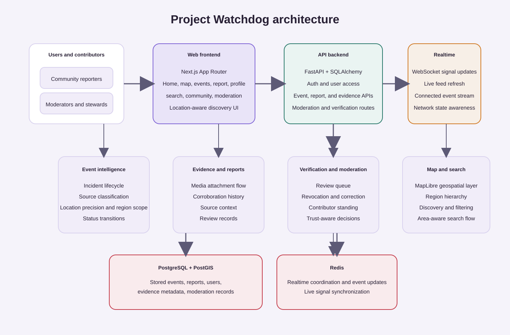

## Technology stack

| Layer | Stack |
| --- | --- |
| Web | Next.js · React · TypeScript |
| API | Python · FastAPI |
| Database | PostgreSQL · PostGIS |
| Runtime / state | Redis · Docker |
| Mapping | MapLibre |
| Quality | Playwright · pytest |

## Security and privacy

Watchdog is designed with an operational approach to trust and safety:

- user identity remains conceptually separate from public reporting
- moderation and review are explicit workflows
- evidence remains distinct from final verification state
- geographic precision can be scoped appropriately for privacy and utility
- internal implementation and operational details are kept private

## Roadmap

The product direction continues to push toward broader situational intelligence:

- regional intelligence and briefing layers
- official-source and organization integration
- richer corroboration and conflict tracking
- stronger live trust and review workflows
- broader public-safety coverage and intelligence layers

## Source code status

This repository is intentionally a public product showcase, not a public source tree for the live Watchdog implementation.

The product is private because it is a security-focused operational platform under active development. The implementation includes architecture, infrastructure, workflows, and operational details that are not suitable for public disclosure.

The public-facing direction remains real, visible, and product-accurate without exposing the private implementation.

## Final note

Watchdog is built for the hard problem of understanding fast-moving local events without treating raw information as fact.

It is a product for context, review, geography, and trust — not for noise, unchecked claims, or social amplification alone.

Watchdog is a global community security and incident intelligence platform.
